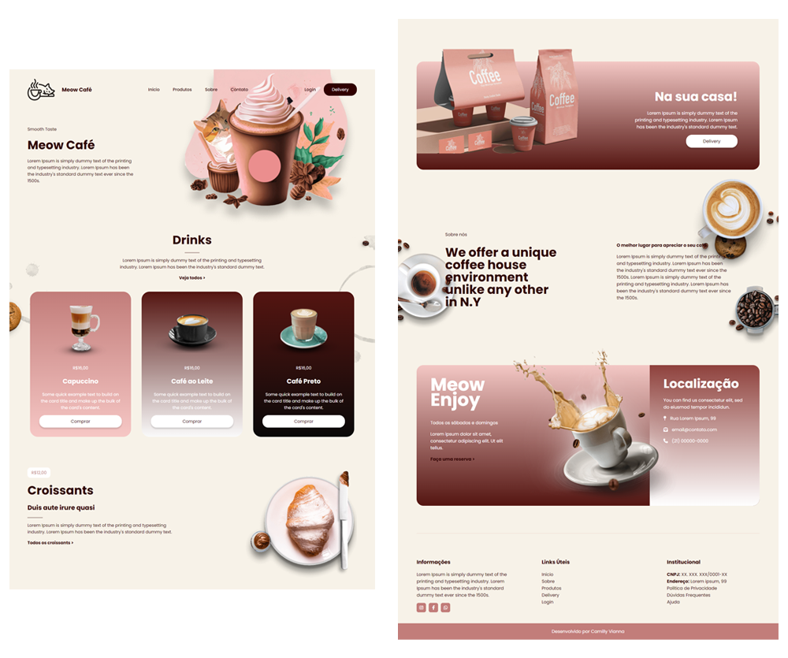
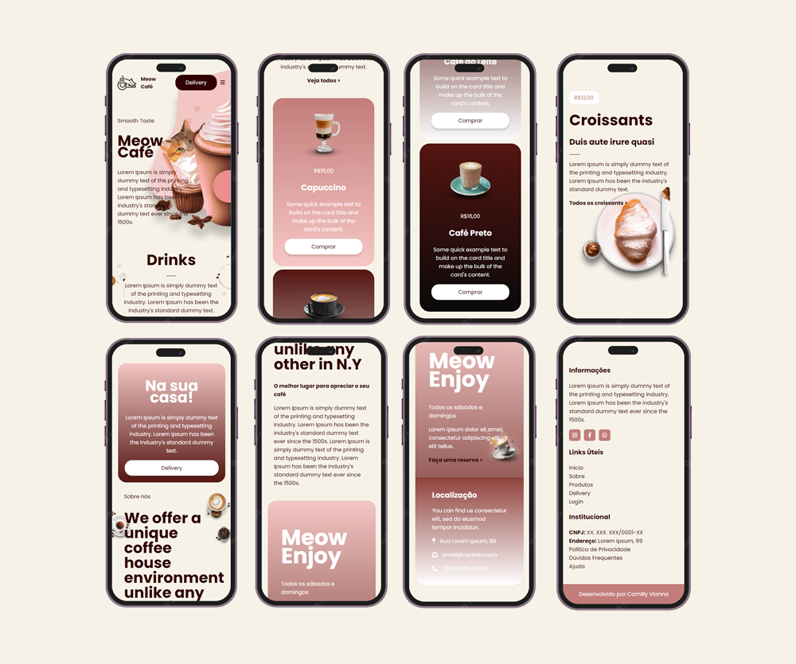

# meow-cafe
## Ideia do projeto - Layout Responsivo para Cafeteria Pet Friendly
O Meow Café é um projeto de layout responsivo desenvolvido para uma cafeteria pet friendly. Esse projeto marca o meu primeiro passo em direção ao desenvolvimento em React, finalmente transformando a minha vontade em realidade.
> LinkedIn: [Camilly Vianna](https://www.linkedin.com/in/camilly-vianna/).

Obrigada por explorar o Meow Café Layout! Espero que você aprecie tanto quanto eu apreciei desenvolvê-lo.
